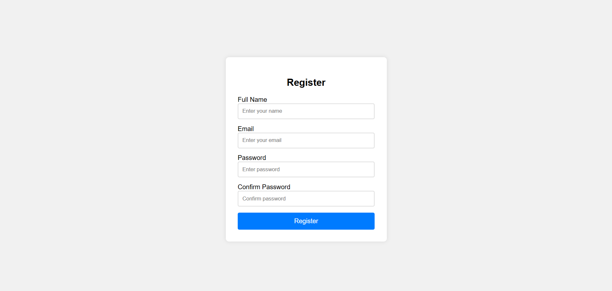

# Form Validation App

A simple, responsive form built using **HTML**, **CSS**, and **JavaScript**, designed to validate user inputs in real-time.

## Features
- Required fields check
- Valid email format validation
- Password length and strength check
- Confirm password match verification
- Responsive UI with clean design

## Live Demo
[Click here](https://snehamp12.github.io/form-validation-app/)

## Screenshot

## Technologies Used
- HTML
- CSS
- JavaScript (Fetch API)
## Author
[Sneha MP](https://github.com/snehamp12)
